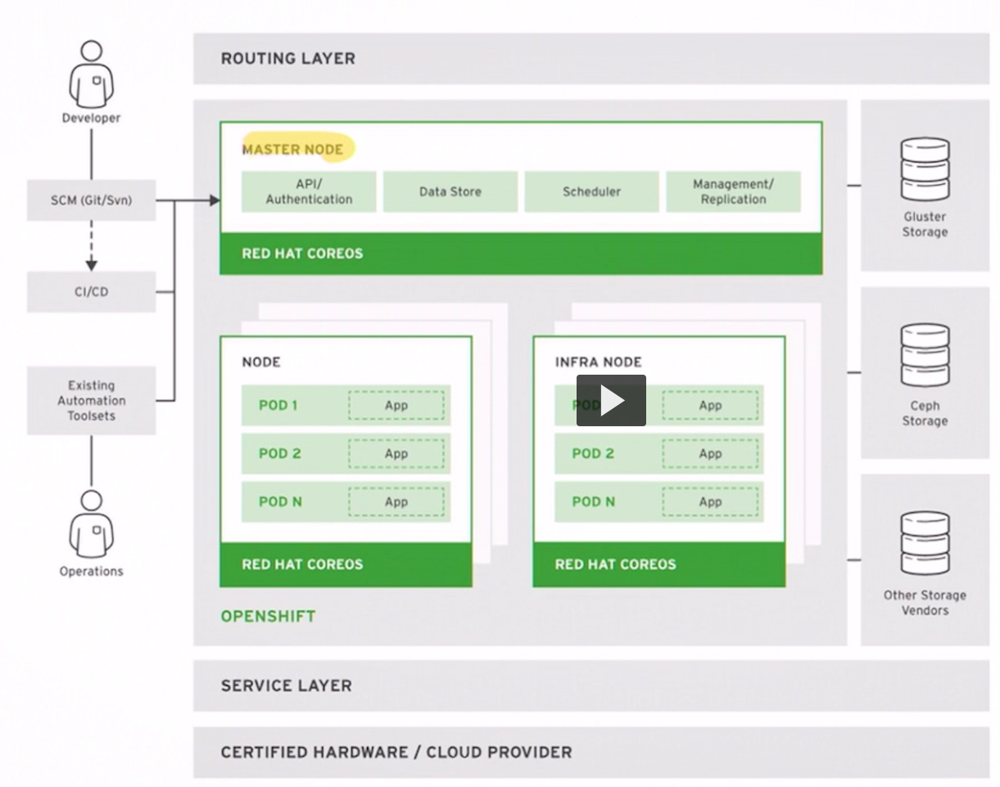
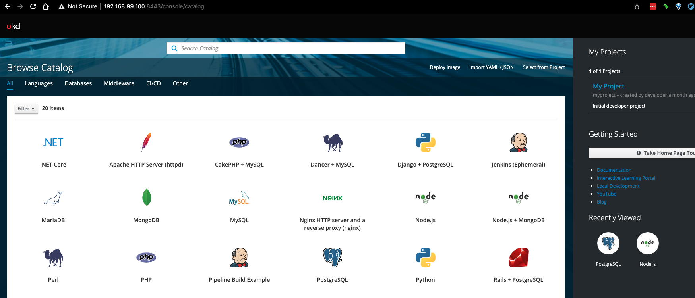
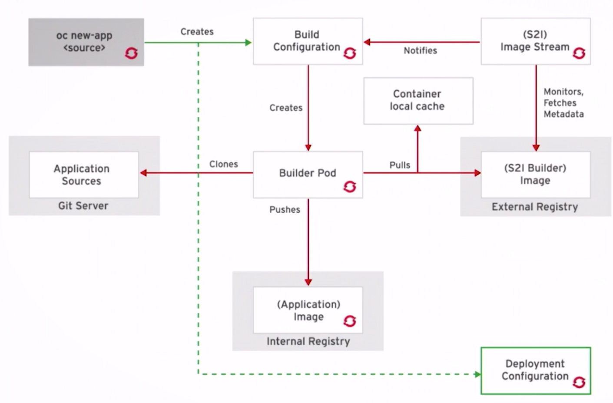

## Overview

[MiniShift](https://www.okd.io/minishift/) is a tool that helps you run OKD locally by launching a single-node OKD cluster inside a virtual machine.

OKD is the community distribution of [Kubernetes](https://kubernetes.io/) that powers [Red Hat® OpenShift®](https://www.openshift.com/).

[Kubernetes](https://kubernetes.io/) is an open-source system for automating deployment, scaling, and management of containerized applications.

[Red Hat® OpenShift®](https://www.openshift.com/) is a certified Kubernetes platform and distribution.

You can run Minishift on the Windows, macOS, and GNU/Linux operating systems.

## Prerequisites

1. [MiniShift](https://www.okd.io/minishift/)

In the following sections we'll use the command line and web browser to create and manage our project web application with database.

MiniShift will give us a single node cluster that includes these components:

[Cluster Components Review](./openshift-components.md)

## Cluster Setup

- Quick reivew of:
- `minishift status`
- `minishfit start`
- `minishift stop`
- `minishift oc-env`
- `eval $(minishift oc-env)`
- `minishift ip`
- `minishift console`

We can project setup and management via the web browser, but we'll be doing the power use mode - command line.

This way our steps are repeatable and fully documented.

As we work through the following commands we'll be flipping back and forth from the console and the web browser.

## Login

- `oc login -u developer`
- `oc get projects`
- `oc project sod-container-lab`

## Create

This is a high level overview of the "flow" through OpenShift that you will create.

- `oc new-project sod-container-lab --description="This is an example project to demonstrate OpenShift" --display-name="SOD OpenShift Workshop"`
- `oc get projects`
- `oc status`

Create a Postgres database from an existing Image

- `oc new-app postgres POSTGRES_PASSWORD=password -e PGDATA=/tmp/data`
- `oc status`
- `oc get pods`

Let's inspect the running pod.

- Example:
- `oc describe pod/postgres-1-gqjtz`
- Lets get the pod name and save it to a variable in our shell so we can access easier
- `PGSQL=$(oc get pods -o name | grep postgres)`
- `echo $PGSQL`
- `oc describe pod $PGSQL`
- `oc cp ../devops/test-database.sh $PGSQL:/tmp/test-database.sh`
- `oc exec -it $PGSQL bash /tmp/test-database.sh`

This is how you remove an OpenShift App

- `oc get all --selector app=postgres -o name`
- `oc delete all --selector app=postgres`

Create our `web-app` containerized app in OpenShift:

`oc new-app 'https://github.com/amtago/openshift-demo-app.git#develop' --name=web-app --context-dir=src/web-app --strategy=docker -e dbhost=postgres.sod-container-lab.svc.cluster.local`

- `oc expose service web-app`

## Export and Backup

Export the OpenShift project so that it can be imported into a different OpenShift server/platform

- `oc get -o yaml --export all > project.yaml`

## Remove - Delete - Clean Up - Reset

- `oc delete project sod-container-lab`

## Restore

- `oc new-project sod-container-lab --description="This is an example project to demonstrate OpenShift" --display-name="SOD OpenShift Workshop"`
- `oc create -f project.yaml`

## Extra Developer Notes

Expose PosgreSQL database for local source and local docker to use:

- `oc describe pod $PGSQL`
- `oc expose service postgres`
- `oc get svc`
- `oc get route`
- `oc port-forward $PGSQL 5432:5432`
- `node ./server.js`
