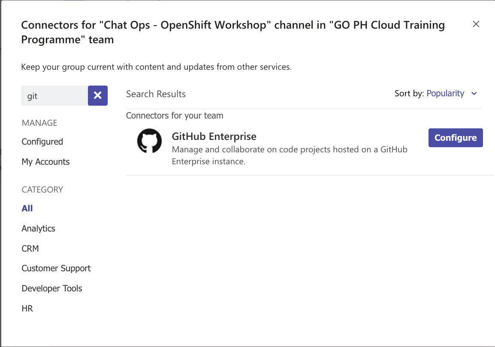

## Chat Ops Setup - MS Teams

How to create a "Chat Ops" channel in MS Teams and configure github.com to send messages to it.

Conversations, put to work. ChatOps is a collaboration model that connects people, tools, process, and automation into a transparent workflow.

This flow connects the work needed, the work happening, and the work done in a persistent location staffed by the people, bots, and related tools.

- Add a new Channel in your Team
  
- Use a descriptive name and useful description
  
- Open up the channel settings and add a new Connector
  
- Search for "git" and click "Configure"
  
- Provide a descriptive name and click "Create"
  
- Scroll down and read the github setup instructions
  
- Click "Done" to complete the MS Teams setup
  
- In your github repo go to the Webhook settings and paste in your webhook URL and set the Content type.
  
- Choose "Send me everything" and click "Add webhook"
  
- You can return to the MS Teams Channel Github connector settings any time you need
  
  
- There should be a new message in the MS Teams channel confirming github is connected
  
- Set a "Custom" channel notification level
  
- Select "Banner and Feed" for All New posts and check the "Include all replies" option, then click "Save"
  
- Messages from github like this commit will now be received.
  
