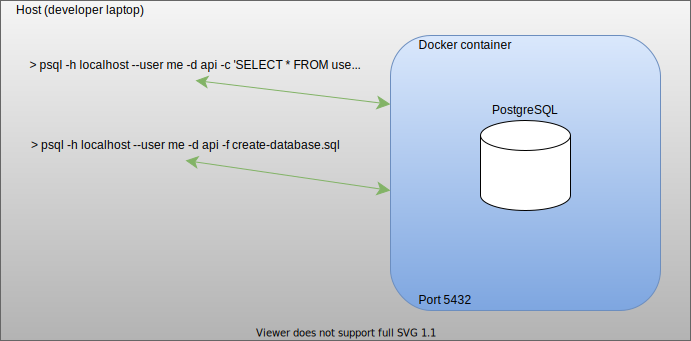
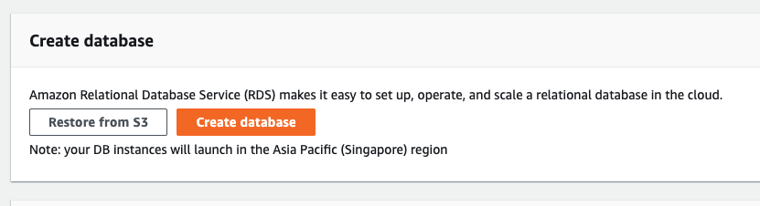
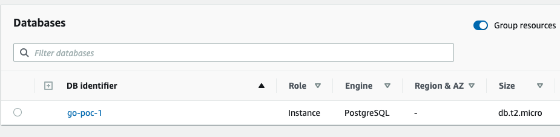
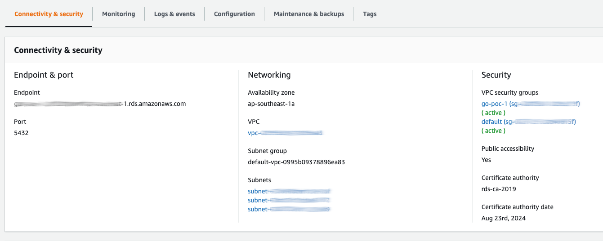
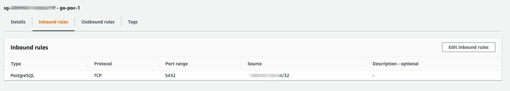
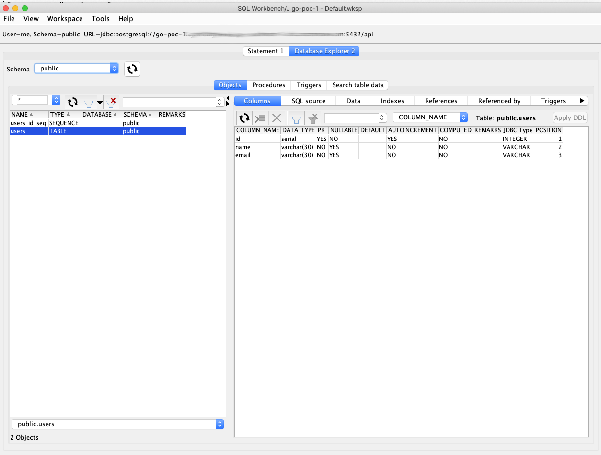
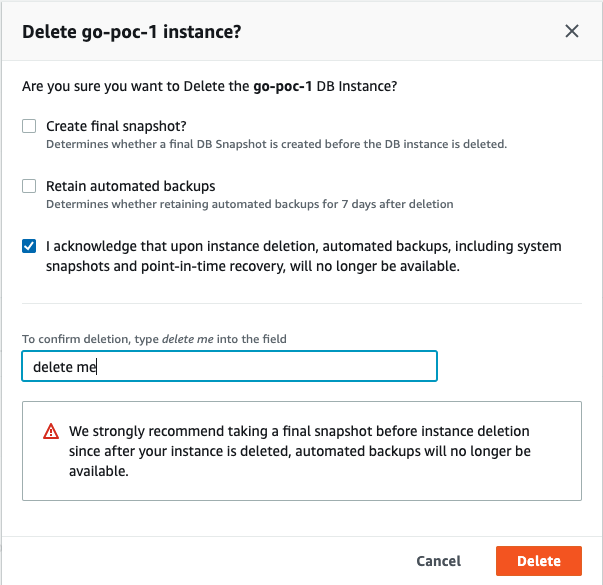

## Overview

POC objectives

Target environment

- Run a database in AWS RDS, then load data from an OpenShift Pod

Developer environments

1. Run a database locally, then load data from a Docker container
2. Run a database locally in OpenShift (minishift), then load data from an OpenShift Pod

## Architecture

- Target environment - Cloud Database, Cloud Storage, Cloud Container Platform

**Developer envrionments**

- Local Container Environment (Docker)

- Local Container Platform Environment (Openshift)

- Local Container Platform Environment (Openshift) with Cloud Database

## Local Container Environment (Docker)

Create a database server and make it available to the host and within the docker network

- `docker run --name pgsql -d -p 5432:5432 --env POSTGRES_PASSWORD=password postgres`

Create a database user (role) that can own and manage databases:

- `docker exec -it pgsql psql --user postgres -c "CREATE ROLE me WITH LOGIN PASSWORD 'password';"`
- `docker exec -it pgsql psql --user postgres -c "ALTER ROLE me CREATEDB;"`

Create a database with the user role:

- `docker exec -it pgsql psql --user me -d postgres -c "DROP DATABASE IF EXISTS api;"`
- `docker exec -it pgsql psql --user me -d postgres -c "CREATE DATABASE api;"`

Run the ETL process

This process will download the database schema and insert rows, then exit

- Build the image
- `docker build -t sod/etl:1.0.0 .`
- Run the ETL process
- `docker run --name etl --link pgsql -e PGPASSWORD=password -e DBHOST=pgsql -it sod/etl:1.0.0 bash /tmp/load-database.sh`
- Clean up the container
- `docker rm -f etl`

## Local Docker Compose Environment

Run queries from the command line outside the container

- `docker exec -it src_database_1 psql --user me -d api -c 'SELECT * FROM users;'`

## Local OpenShift environment

Create a database user (role) that can own and manage databases:

- `oc exec -it $PGSQL -- psql --user postgres -c "CREATE ROLE me WITH LOGIN PASSWORD 'password';"`
- `oc exec -it $PGSQL -- psql --user postgres -c "ALTER ROLE me CREATEDB;"`

Create a database with the user role:

- `oc exec -it $PGSQL -- psql --user me -d postgres -c "DROP DATABASE IF EXISTS api;"`
- `oc exec -it $PGSQL -- psql --user me -d postgres -c "CREATE DATABASE api;"`

Create a Build Config from the source (develop branch)

- `oc new-build --name etl --context-dir=src/etl https://github.com/amtago/openshift-demo-app.git#develop`

Execute the Task/Job

- `oc delete pod etl`
- `oc run -it --rm=true etl --image=172.30.1.1:5000/sod-container-lab/etl --replicas=1 --restart=Never --env DBHOST=postgres.sod-container-lab.svc.cluster.local --env PGPASSWORD=password -- bash /tmp/load-database.sh`

Replace/Change/Update the database

- DROP DATABASE (see command above)
- CREATE DATABASE (see command above)
- `oc delete pod etl`
- `oc run -it --rm=true etl --image=172.30.1.1:5000/sod-container-lab/etl --replicas=1 --restart=Never --env DBHOST=postgres.sod-container-lab.svc.cluster.local --env PGPASSWORD=password -- bash /tmp/load-database.sh create-database-2.sql`

## Local OpenShift with Cloud Database

- Create a publicly accessible (with credentials and source IP restrictions) PostgreSQL database in AWS RDS.

For reference see this [AWS PostgreSQL Tutorial](https://aws.amazon.com/getting-started/tutorials/create-connect-postgresql-db/)

- Using a micro instance size (free tier $$)

- Copy/Save the access credentials for sharing

- Check and configure the Security Group restricted access by IP address

Next up we'll configure the cloud database with a user account for clients to use.

We'll be doing this on the command line.

- Copy and export some shell variables
- `export DBHOST=<rds_connection_endpoint>`
- `export PGPASSWORD=<postgres_password>`
- Check the connection is OK
- `psql -h $DBHOST --user postgres --dbname postgres`
- Create the Role and Database
- `psql -h $DBHOST --user postgres --dbname postgres -c "CREATE ROLE me WITH LOGIN PASSWORD 'password';"`
- `psql -h $DBHOST --user postgres --dbname postgres -c "ALTER ROLE me CREATEDB"`
- As the database user (client) create an empty database
- `export PGPASSWORD=<me_password>`
- `psql -h $DBHOST --user me --dbname postgres -c "CREATE DATABASE api"`
- Run the ETL process (export the client password as if not done already)
- `export PGPASSWORD=<me_password>`
- Check we are logged in to OpenShift, log in if not
- `oc get pods`
- `oc run -it --rm=true etl --image=172.30.1.1:5000/sod-container-lab/etl --replicas=1 --restart=Never --env DBHOST=$DBHOST --env PGPASSWORD=password -- bash /tmp/load-database.sh`

We can also use SQL Workbench to confirm before sharing access

## Drop / Restore / Re-Create / Re-build

When you need to reload or repopulate the database, you can drop database using SQL or destroy the entire database instance and create new.

Regular destroy and creation is a good practise.

