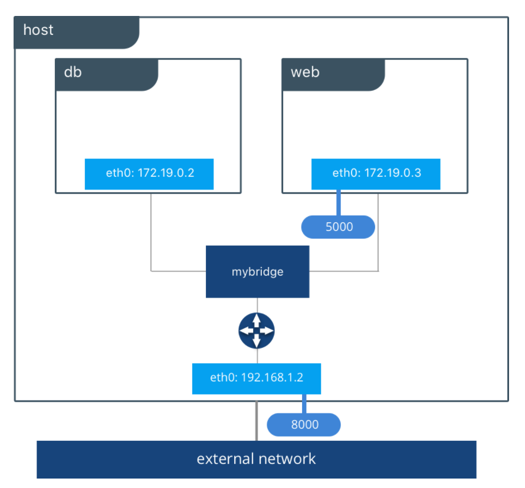
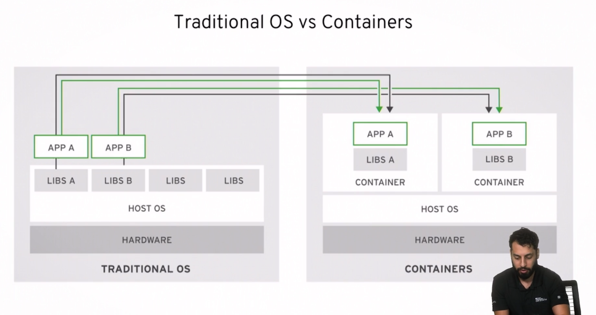

## Overview

Develop a simple HTML/CSS web app with Node and Express.

We'll build a two container application - web app and database.



## Install

- `git clone git@github.com:amtago/openshift-demo-app.git`
- `cd openshift-demo-app`
- `git checkout develop`

<hr>

## Local Source Mode

First we'll code using what we call 'local mode', where the source code runs directly on your workstation:

- `cd src`
- `npm install`
- With all the dependencies installed, let's run the tests
- `npm run coverage`
- We can also view the [test coverage report](coverage/lcov-report/index.html)
- Now let's start the application running locally
- `node server.js`
- Open [localhost:3000](http://localhost:3000)
- We have to restart the server with each code change, instead of that we use `nodemon` to restart the local server on code changes:
- `npm run server`

Now we'll make a change to the application source code and view the update in real time.

In `server.js` update the HTML CSS background-color property from blue to yellow and save:

```
/* background-color: lightblue; */
background-color: lightyellow;
```

<hr>

## Run application dependencies locally in a Docker container

Docker is a "Container" technology.

Containers are a set of one or more processes that are isolated from the rest of the system.

They provide many of the same benefits as a Virtual Machine.



- Some features include
  1. Low Hardware Footprint
     - use of cgroups and namespaces create an isolated environment minimizing CPU and memory overhead
  2. Quick and Reusable Deployment
     - Using an Image allows for creating multiple containers from the same blueprint
  3. Environment isolation
  4. Multiple Environment Deployment
     - reliable to use the exact same image in different stages (dev, prod etc)

\* Reference learning materials [RedHat DO080 course (free)](https://www.redhat.com/en/services/training/do080-deploying-containerized-applications-technical-overview)

<hr>

Let's now add a SQL database to our application.

We'll use PostgreSQL and run it directly with Docker.

We can review the free to use [Docker Image](https://hub.docker.com/_/postgres) for PostgreSQL.

```
docker run --name pgsql -p 5432:5432 -e POSTGRES_PASSWORD=password postgres


The files belonging to this database system will be owned by user "postgres".                                                                                                This user must also own the server process.

The database cluster will be initialized with locale "en_US.utf8".
...
...
...
2021-01-07 03:04:30.715 UTC [1] LOG:  database system is ready to accept connections
```

We can view the running container

```
docker ps

CONTAINER ID   IMAGE      COMMAND                  CREATED         STATUS         PORTS                    NAMES
42a872814d9f   postgres   "docker-entrypoint.s…"   4 seconds ago   Up 3 seconds   0.0.0.0:5432->5432/tcp   pgsql
```

Copy in a test database setup script

`docker cp ../devops/test-database.sh pgsql:/root/test-database.sh`

Run the database setup script in the container

```
> docker exec -it pgsql bash /root/test-database.sh

CREATE ROLE
ALTER ROLE
CREATE DATABASE
CREATE TABLE
INSERT 0 2
 id | name  |       email
----+-------+-------------------
  1 | Bob   | bob@example.com
  2 | Alice | alice@example.com
(2 rows)
```

Open [localhost:3000/users](http://localhost:3000/users)

<hr>

## Local Docker (container) Mode

The next stage is to build and run the web app in a container directly on your workstation.

The following steps are the commands to run and samples of the output.

For reference our steps are based on the official example from the [node docs](https://nodejs.org/en/docs/guides/nodejs-docker-webapp/)

Lets first take a look at the [Dockerfile](./Dockerfile)

- Example: "docker build -t your-username/app-name:version ."
- `docker build -t sod/webapp:1.0.0 .`

```
docker build -t sod/webapp:1.0.0 .
[+] Building 84.6s (10/10) FINISHED
 => [internal] load build definition from Dockerfile                                                                                               0.0s
 => => transferring dockerfile: 426B                                                                                                               0.0s
 => [internal] load .dockerignore                                                                                                                  0.0s
 => => transferring context: 67B                                                                                                                   0.0s
 => [internal] load metadata for docker.io/library/node:14                                                                                         4.7s
 => [1/5] FROM docker.io/library/node:14@sha256:75e1dc0763f97d0907b81e378d0242ab9034fb54544430898b99a3ac71fa0928                                  77.3s
 => => resolve docker.io/library/node:14@sha256:75e1dc0763f97d0907b81e378d0242ab9034fb54544430898b99a3ac71fa0928                                   0.0s
 => => sha256:bac289a6f393990e759c672d5f567553c697255d1fb858e2c62d086a2dfae44a 2.21kB / 2.21kB
...
...
...
 => => extracting sha256:564b924d97f1b041031376f445927411e0dca866584f0e74ab0ddd62ab73f3aa                                                          0.0s
 => [internal] load build context                                                                                                                  0.0s
 => => transferring context: 16.11kB                                                                                                               0.0s
 => [2/5] WORKDIR /usr/src/app                                                                                                                     0.1s
 => [3/5] COPY package*.json ./                                                                                                                    0.0s
 => [4/5] RUN npm install                                                                                                                          2.2s
 => [5/5] COPY . .                                                                                                                                 0.0s
 => exporting to image                                                                                                                             0.1s
 => => exporting layers                                                                                                                            0.1s
 => => writing image sha256:7e3d902eb49f4c8e1be77aa16673cd6dc8763a1ad0dc696154f5dfb3a4de4397                                                       0.0s
 => => naming to docker.io/sod/webapp:1.0.0

```

We can list the available Images:

```
> docker images
REPOSITORY TAG IMAGE ID CREATED SIZE
sod/webapp 1.0.0 7e3d902eb49f 23 minutes ago 945MB
docker/getting-started latest 021a1b85e641 2 weeks ago 27.6MB

```

Let's now run a single instance of the Image - a container instance:

```
docker run --name app -p 8080:3000 sod/webapp:1.0.0
```

Open [localhost:8080](http://localhost:8080)

```
docker ps

CONTAINER ID   IMAGE                     COMMAND                  CREATED          STATUS          PORTS                    NAMES
b1a542c3622c   sod/webapp:1.0.0   "docker-entrypoint.s…"   2 minutes ago    Up 2 minutes    0.0.0.0:8080->3000/tcp   app
42a872814d9f   postgres                  "docker-entrypoint.s…"   33 minutes ago   Up 29 minutes   0.0.0.0:5432->5432/tcp   pgsql
```

Open [localhost:8080/users](http://localhost:8080/users)

We need to manually connect, or "wire together", the `web-app` container and the `pgsql` container.

Lets get the IP address for the PostgreSQL server:

- `docker inspect pgsql`

There's also a short cut using a query string

- `docker inspect -f '{{range .NetworkSettings.Networks}}{{.IPAddress}}{{end}}' pgsql`

Lets restart the web app container and set the IP address for the database host:

1. `DBHOST=$(docker inspect -f '{{range .NetworkSettings.Networks}}{{.IPAddress}}{{end}}' pgsql)`
2. `docker run --name app -p 8080:3000 -e dbhost=$DBHOST sod/webapp:1.0.0`

Let's now look at some examples of:

1. Changing source code and see difference between the local source and local docker apps
2. Cause a database connection error and review the logs
3. Rebuild the web app image and create a new container to show update code from the local source env

<hr>

## Local Docker Compose Environment

Let's now make our local container environment easier by using Docker Compose.

Let's look at our [docker-compose.yml](./docker-compose.yml) file.

- Stop the PostgreSQL container
- Stop the web-app and database containers
- `docker rm -f app pgsql`
- run `docker-compose up'
- `docker-compose up`

We now have a new database instance and a new app container running:

```
docker ps

CONTAINER ID   IMAGE                     COMMAND                  CREATED          STATUS          PORTS                    NAMES
4ac403e64bbe   sod/webapp:1.0.0   "docker-entrypoint.s…"   55 seconds ago   Up 54 seconds   0.0.0.0:8081->3000/tcp   src_web_1
a29ac8e8e32f   postgres                  "docker-entrypoint.s…"   56 seconds ago   Up 55 seconds   0.0.0.0:5432->5432/tcp   src_database_1
```

We'll recreate our `users` database:

1. `docker cp ../devops/test-database.sh src_database_1:/root/test-database.sh`
2. `docker exec -it src_database_1 bash /root/test-database.sh`

Finally lets set docker-compose to run in the background and follow the logs

- `ctl-c to exist docker-compose`

```
> docker-compose up -d

Starting src_database_1 ... done
Starting src_app_1      ... done


> docker logs --follow src_app_1

> docker logs --follow src_database_1
```

<hr>

## Local OpenShift using MiniShift

Next let's look at using a [Container Orchestration Platform locally](../../devops/README.md).

<hr>

## Developer Notes

- [blog.logrocket.com/nodejs-expressjs-postgresql-crud-rest-api-example](https://blog.logrocket.com/nodejs-expressjs-postgresql-crud-rest-api-example/)
